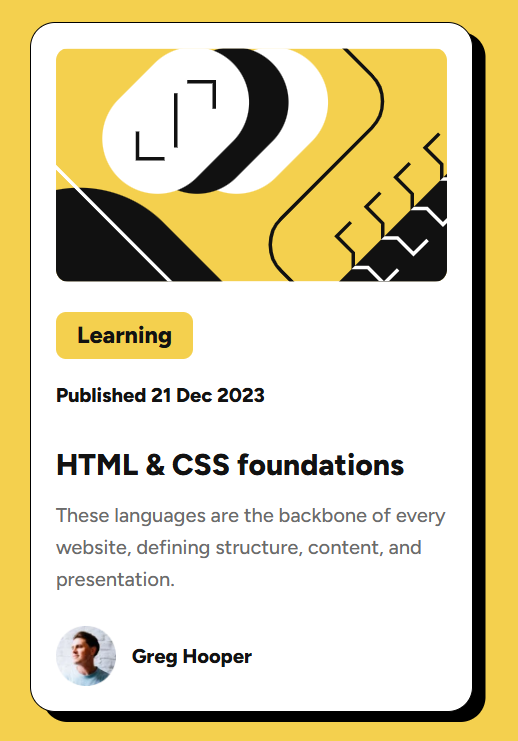
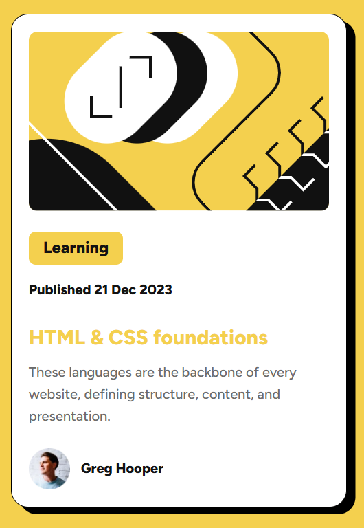

## Frontend Mentor - Blog preview card solution

This is a solution to the [Blog preview card challenge on Frontend Mentor](https://www.frontendmentor.io/challenges/blog-preview-card-ckPaj01IcS). Frontend Mentor challenges help you improve your coding skills by building realistic projects. 

## Table of contents

- [Overview](#overview)
  - [The challenge](#the-challenge)
  - [Screenshot](#screenshot)
  - [Links](#links)
- [My process](#my-process)
  - [Built with](#built-with)
  - [What I learned](#what-i-learned)
  - [Continued development](#continued-development)
- [Author](#author)

## Overview

### The challenge

Users should be able to:

- See hover and focus states for all interactive elements on the page

### Screenshot




### Links

- Solution URL:(https://github.com/samsdivstudios/Blog-Preview-Card)
- Live Site URL:(https://samsdivstudios.github.io/Blog-Preview-Card/)

## My process

### Built with

- Semantic HTML
- CSS/Variables
- Flexbox
- Mobile-first workflow

### What I learned
What I have learned recreating this blog card was how to make an image and text sit inline with each other, and for the first time make an active state.
I also learned on my own before Frontend mentor was Variables which you will see in my CSS code I used it for the first time so handy


```html
    <footer>
      
      <p class="name">Greg Hooper</p>
    </footer>
```
```css
:root {
    --bg-color-: hsl(47, 88%, 63%);
    --card-color-: hsl(0, 0%, 100%);
    --text-: 500;
    --title-: 800;
    --gray-500-: hsl(0, 0%, 42%);
    --gray-950-: hsl(0, 0%, 7%);
}
```
### Continued development
Area's I want to work on is keeping style clean and short. I will be focusing Media Queries as its not my strongest thing to do I will be revisiting this repo to put into practice other ways to create this card again.

## Author

- Website - [Sam Walsh](https://www.your-site.com)
- Frontend Mentor - [samsdivstudios](https://www.frontendmentor.io/profile/samsdivstudios)
- X.com - [@samdivstudio](https://x.com/samdivstudio)
